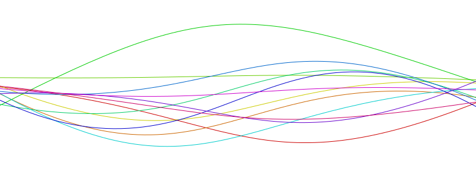

# react-random-shapes



Create a random, wavy `svg` image. A few different shapes are planned:

* [`RandomHLine`](#randomhline)
* [`RandomVLine`](#randomvline)
* [`RandomBlob`](#randomblob)

This package was inspired by [blobmaker.app](https://www.blobmaker.app/).

[](https://www.npmjs.com/package/react-random-shapes) [](https://standardjs.com)

## Install

```bash
npm install --save react-random-shapes
```

## Usage

```jsx
import React from 'react'

import RandomHLine from 'react-random-shapes'

export default function Example() {
  return <RandomHLine width={600} height={300} />
}
```

For all shapes, `width` and `height` attributes are required. Additionally, various options could be specified.

### `RandomHLine`

Generates a horizontal line (going roughly from left to right).

#### Options

Options available are:

* `leftPos` (default `0.5*height`) Vertical position of the left handle.
* `rightPos` (default `0.5*height`) Similar to `leftPos`.
* `posWindowSize` (default `0.2*height`) Size of the square in which the control points could wiggle around.
* `angleWindowSize` (default `Math.PI / 3`) Size of the window in which the angle of the control line (measured from the control point) could wiggle around.
* `numControls` (default `2`) Number of control points the line should have.
* `styleTop` (default `"none"`) Style of the top part.
* `styleBottom` (default `"none"`) Style of the bottom part.
* `styleMid` (default `{fill: "transparent", stroke: "black"}`) Style of the mid-line part.
* `classNameTop` (default `""`) Class name for the top part.
* `classNameBottom` (default `""`) Class name for the bottom part.
* `classNameMid` (default `""`) Class name for the mid-line part.
* `showHandles` (default `false`) Show the handles and control points (for debug purpose).

#### Overriding

For more flexibility, you could "override" these points by adding the `override` attribute.
This should be an array of the same length as the number of control points (the length of the `override` array will override if this is not true.)
Each entry represents the override for each control point.
If the entry is `null`, `undefined`, or `"auto"`, there will be no overriding.
To override, the entry must be an object with 3 possible keys: `x`, `y`, and `angle`.
Each key's value will specify the override mode for that control point.
There are 4 possible modes:

* `null`, `undefined`, or `"auto"`
* `["p", value]`: specify the exact value of that key.
* `["w", value]`: specify the size of the window while having the center position automatically adjusted.
* `["r", l_bound, u_bound]`: specify the lower and upper boundries for that key.

#### Examples

```js
override = [
  {
    angle: ["r", 0, Math.PI / 4]
  },
  "auto",
  "auto",
  {
    x: ["p", 500],
    y: ["r", 10, 15] 
  },
  "auto"
]
```

### `RandomVLine`

[Not yet available.]

### `RandomBlob`

[Not yet available.]

## Todo's

* Implement `RandomVLine` and `RandomBlob`.
* Accept attribute `width` and `height` as strings.
* Calculate slope based on two closest fixed points.
* Add API that will generate random, wavy svg's for all!

## License

MIT © [artt](https://github.com/artt)
